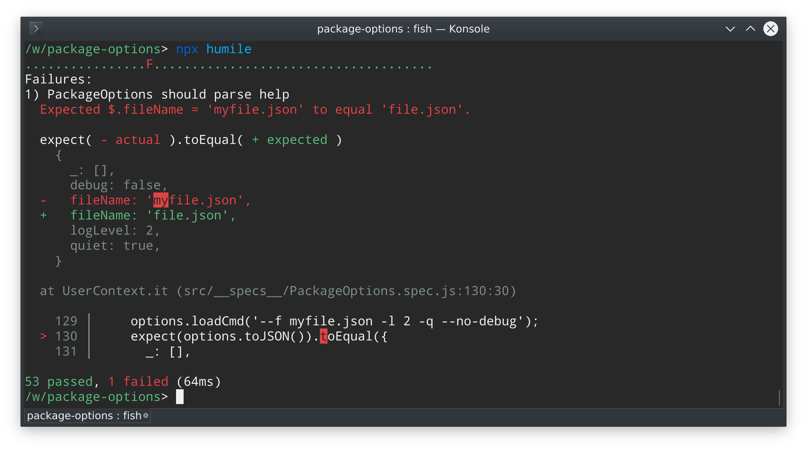

# humile
[](https://travis-ci.org/megahertz/humile)
[](https://badge.fury.io/js/humile)

Make Jasmine Great Again!

## Description

Humile is Node.js test framework on top of Jasmine. It's as fast and lightweight
as Jasmine, but has many additional features:

 - Nice exception reports
 - Clean stack trace
 - Zero config
 - No globals (optional)
 - TypeScript ready
 - Customization



## Usage

1. Create the first test spec

    **my-first.spec.js**
    
    ```js
    describe('my first spec', () => {
      it('should test a simple value', () => {
        expect(true).toBe(true);
      });
    });
    ```
   
   You can place this file in any subdirectory of your project. Humile searches
   for *.spec.js and *.test.js files (or ts equivalent) in the current dir.

2. Run humile

    `$ npx humile`

## [Configuring](docs/config.md)

In most cases you can use humile with default configuration. However, it can be
easily customized.

Here are the most useful options:

- Test only specified specs

    `humile 'mymodule/*.spec.js'`

- Filter by spec description:

    `humile -f MySpecName`

- Disable global jasmine functions (describe, expect, it etc):

    `humile -G`
    
- Ignore some files:

    `humile -i 'build/**'`
    
- Use another reporter:

    `humile -R list`

Learn more about [configuring humile](docs/config.md).
